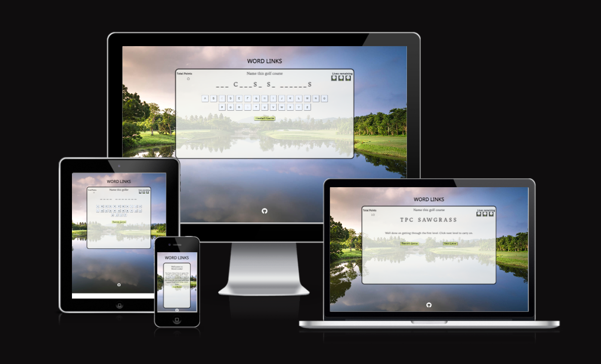
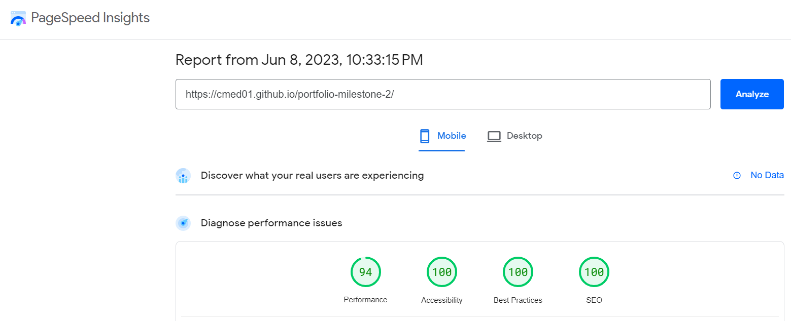
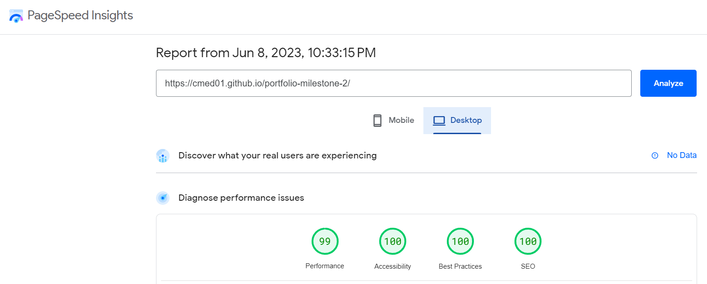

# __Portfolio Project 2 - JavaScript__
## __Word Links__

### __Demo__

The live site can be viewed here - [Word Links](https://cmed01.github.io/portfolio-milestone-2/)

Github repository can be viewed here - [CMed01/portfolio-milestone-2](https://github.com/CMed01/portfolio-milestone-2)

## Table of Contents
* [User Experience](#user-experience)
* [Technologies](#technologies)
* [Testing](#testing)
* [Deployment](#deployment)
* [Credits](#credits)

## __User Experience__

### __Strategy__
The aim of the website is to display an interactive golf themed hangman game.
Reasons for the site:
* Enjoyment
* Quiz

#### __User Stories__
* As a user I want to be able to:

    1. Easily understand the main purpose of the website.
    2. Easily navigate throughout the website to find and interact with the content.
    3. Access the site from different devices
    4. Play 3 rounds of the hangman style game.
    5. See a running points counter.
    6. Get feedback on whether answers were correct or not.
    7. On successful completion of the game, obtain a high score and feedback message.
    8. Restart/reset the game and enjoy playing the game multiple times.

### __Scope__
Functionally the site must be:
* Easy to navigate
* Well presented and display a fully functioning golf themed hangman-style game

Content should include the following:
* Provide the user with the rules of the game.
* Provide interactive functionality to play the game.
* Link to the developers GitHub account.

### __Structure__
Based on the content required in the scope of this project, this website will consist of only 1 page. The home page will have the game title and display clearly the rules of the game with a start button. On click of the start button the game will load and have interactive functionality. The game will be contained in a centralised container, with a golf themed background image.

### __Skelton (Wireframes)__

Single wireframe image. The website will be responsive fitting all elements inside the width of the user screen.

 

 
Addition to the wireframe includes:
* Points counter.
* Timer.
* Restart buttons that will appear after game loading.

### __Surface (including Features)__
#### __Colour Scheme__

#### __Typography__
*  Google fonts was used for the typography for this website
    * Fira Sans - used for all heading 1 elements
    * Noto Sans - used for all other headings and labels
    * Trykker - used for all other body elements
    * Sans serif - used as back-up font
 
#### __Features__
* Home page
    * Game title to be visible at the top of the page. 
    * Clear game container displaying the rules of the game and a "new game" start button.
    * The background displays a scenic golf hole immersing the user into the theme for the game.
    * A GitHub link will be present at the bottom of the page and when clicked th user will be taken to the developers GitHub repository

 

* New game button
    * On click of this button, the following will take place:
        1. A life counter will load and display three lives, each represented with a golf ball on a tee image.
        2. A points counter will load displaying "0" at the start of the game.
        3. A keyboard with 26 individual buttons, container letters A-Z, will appear. These buttons will have clickable functionality.
        4. A random question will load at the top of the screen.
        5. The answer to the question will appear obscured by a series of dashes. Each dash represents a letter in the answer.
        6. The answer will appear initially with a blank underscores, each underscore representing a letter.
        7. The "new game" button will be replaced with a "restart button", which when clicked will reload the page and bring the user back to the start

 

* Game screen
    * The user can interact with the game by clicking on individual letters. Doing so will check if the chosen letter matches a letter in the randomly generated hangman
    * If the letter is correct, then it will replace the underscore with the chosen letter
    * If the letter is not correct, the user will lose a life, which will be reflected the lives counter
    * After pressing a button, the button will be disabled preventing duplication.

* Level complete
    * If the user selects all the correct letters without losing all their lives. The keyboard will be replaced with a winning message (a different one for level 1 and level 2).
    * The points counter will be updated to reflect the win, with a total of 10 points on offer. 
    * Each life lost will reduce the score by 2 points.
    * A "next level" button will appear alongside the "restart button", and when clicked will generate another random question.

* Completion of game
    * If the user successfully completes three levels, the keyboard will be replaced with a congratulations message.
    * The total points scored by the user will be included in the message.
    * Only the restart button will be present allowing the user to replay the game.
    

* Game over
    * If the user selects three incorrect letters before the word is fully revealed the keyboard will be replaced with a game over message. 
    * The full word will not be revealed to allow for replayability
    * A "restart game" button will be present for the user to click and restart the game. On click the page will be reloaded, subsequently restarting the game.

* Future
    * Add code to prevent recurrent questions being selected during one game (i.e. between level 1, 2 and 3)
    * Increased question bank to improve replayability
        * There are currently 20 questions. This can be increased substantially to allow further replayability.
    * Allow user to filter the question choice
        * Currently the questions are all contained in a single array. Future changes can group these into categories, allowing the user to filter the questions asked.
    * Allow user to chose the size of the questions for each game (currently set at 3 levels). This will further increase replayability.
    * Hint button
        * For each question, there will be two hints on offer.
        * A button will be present for the user to reveal these hints providing support to the user to answer the hangman correctly
        * Each hint will diminish the score by 2 points. 
    * Record user's high scores
        * There is currently no function for the user to enter in any personal details, such as a username. Addition of this will further enhance user replayability.
        * A high score storing function will challenge users to beat their previous attempts.
    * Introducee a timer function to add extra pressure to answer all questions correctly.

## __Technologies__

### __Languages__

* HTML
* CSS
* JavaScript

### __Frameworks, programs and libraries__

* [Figma](https://www.figma.com/) - Used to create wireframes for this website.
* [Stack Overflow](https://stackoverflow.com/) - Used to troubleshoot HTML, CSS and JavaeScript coding queries.
* [Google Fonts](https://fonts.google.com/) - Used to apply fonts to this website.
* [Fontjoy](https://fontjoy.com/) - Used to create font pairings.
* [Am I Responsive?](https://ui.dev/amiresponsive) - Used to create an image of website on various screen sizes.

## __Testing__

### __Validator testing__

* __[W3C Markup Validation Service](https://validator.w3.org/)__
    - Pass with no errors or warnings
    - 

 

* __[W3C CSS Validation Service](https://jigsaw.w3.org/css-validator/)__
    - Pass with no errors found.
    - 
    
     

* __[JavaScript Testing (JSHint)](https://jshint.com/)__
    - There are 16 functions in this file.
    - Function with the largest signature take 2 arguments, while the median is 0.
    - Largest function has 15 statements in it, while the median is 6.
    - The most complex function has a cyclomatic complexity value of 4 while the median is 2.
    - 1 warning on line 174
        - Functions declared within loops referencing an outer scoped variable may lead to confusing semantics. (btnArray, button, dash, winCount, spaceCount, blocker, levelWon, loseCount, removeLifeIcon, gameOver)
        - Nil errors/bugs found in testing
    - Initially one unused variable - nextLevelBtn
        - This variable is related to a function, which is added an an attribute when creating a new level button. 
        - Change set attribute to addEventListener and variable now used.

* __Lighthouse testing using [PageSpeed Insights](https://pagespeed.web.dev/)__
    - Performance can be improved on mobile by:
        - Eliminating render-blocking resources
        - Updating images to next gen formulas
    - 
    - 

### __Browser Compatability__
* Browser testing was completed on the following browsers using [SauceLabs](https://saucelabs.com/)
    - Chrome Version 112.0.5615.138 (Official Build) (64-bit)
    - Firefox Version 111.0 (64-bit) 
    - Edge Version 112.0.1722.34 (Official Build) (64-bit)
    - Safari Version 16.1 (18614.2.9.1.12) (accessed via macOS Ventura 13) 

### __Test Cases and Results__

The below table details the test cases that were used. 

 

| Test no. |                    Test Label                   |                                                                                                                                     Test Action                                                                                                                                    |                                                                                                                                                                                                                    Expected Outcome                                                                                                                                                                                                                   | Test Outcome |
|:--------:|:-----------------------------------------------:|:----------------------------------------------------------------------------------------------------------------------------------------------------------------------------------------------------------------------------------------------------------------------------------:|:-----------------------------------------------------------------------------------------------------------------------------------------------------------------------------------------------------------------------------------------------------------------------------------------------------------------------------------------------------------------------------------------------------------------------------------------------------:|:------------:|
| T01      | UX - Page Load                                  | Load page                                                                                                                                                                                                                                                                          | The game container is central to the page and contains the following: 1. The title is capitalised 2. A welcome message appears 3. A new game button with a light green background appears                                                                                                                                                                                                                                                              | Pass         |
| T02      | Interaction - New game button                   | On click of new game button                                                                                                                                                                                                                                                        | On click: 1. new game button disappears 2. Total Points displayed with a value of 0 (top-left)  2. Question displayed (top center)   3. Lives remaining displayed and three square images, evenly spaced (top right)  4. A hangman styled display with a number of underscores  5. A keyboard with 26 evenly spaced letter buttons is displayed  6. Restart game button appears                                                                       | Pass         |
| T03      | Interaction - Restart Button                    | On click of restart button                                                                                                                                                                                                                                                         | On click: 1. Home page (see T01) is displayed. 2. Restart button disappears.                                                                                                                                                                                                                                                                                                                                                                          | Pass         |
| T04      | UX - Letter buttons                             | After click - new game button                                                                                                                                                                                                                                                      | 26 letter buttons evenly spaced, with a light blue background displayed with letters from A-Z (no duplicates.                                                                                                                                                                                                                                                                                                                                          | Pass         |
| T05      | Interaction - Active letter button click        | Click on active letter button                                                                                                                                                                                                                                                      | Button becomes inactive/letter is faded.                                                                                                                                                                                                                                                                                                                                                                                                              | Pass         |
| T06      | Interaction - Inactive letter button click      | Click on inactive letter button                                                                                                                                                                                                                                                    | Nothing happens -- no hangman letters revealed, key remains the same. No functions processed.                                                                                                                                                                                                                                                                                                                                                         | Pass         |
| T07      | Interaction - Correct letter click              | Click on active letter button                                                                                                                                                                                                                                                      | Corresponding letters are revealed everywhere it occurs in hangman phrases.                                                                                                                                                                                                                                                                                                                                                                              | Pass         |
| T08      | Interaction - Lives exhausted                   | Click on incorrect active letter button                                                                                                                                                                                                                                            | One image (life) is removed from lives remaining.                                                                                                                                                                                                                                                                                                                                                                                                     | Pass         |
| T09      | Interaction - Game over                         | Click on 3 incorrect active letter buttons                                                                                                                                                                                                                                         | Letter buttons disappear. Game over message appears - "Unlucky, you did not enter the correct letters. Click on restart game and give it another go" Restart button appears New game button disappears                                                                                                                                                                                                                                                 | Pass         |
| T10      | Interaction - Restart button                    | Click on restart button Repeat after level 1 and 2                                                                                                                                                                                                                                 | Page reloads to home page - see T01 Points counter resets to 0                                                                                                                                                                                                                                                                                                                                                                                        | Pass         |
| T11      | Interaction - Level won                         | Click on all correct active button (number vaires depending on answer)                                                                                                                                                                                                             | Letter buttons disappear. Next level button added Restart button remains Level win message appears                                                                                                                                                                                                                                                                                                                                                    | Pass         |
| T12      | UX - Level Win                                  | Complete T11 three times successfully                                                                                                                                                                                                                                              | Winning message displayed Level 1 - "Well done on getting through the first level. Click next level to carry on" Level 2 - "Well done on getting through the second level. Click next level to take on the final challenge." Level 3 (game won) - "Well done on completing the Word Links Game. You socred a total of 28 points. Click on new game and see if you can beat your previous score or try new questions."                                 | Pass         |
| T13      | Interaction - Next Level                        | On click of next level button Repeat after level 1 and level 2                                                                                                                                                                                                                     | New question generated letter buttons reappear Next level button disappears Lives remaining return to three lives Points - see T14                                                                                                                                                                                                                                                                                                                      | Pass         |
| T14      | Interaction - Points counter (page load)        | On page load (T01)                                                                                                                                                                                                                                                                 | Points count = 0                                                                                                                                                                                                                                                                                                                                                                                                                                      | Pass         |
| T15      | Interaction - Points counter (level one)        | After successfully clicking correct letter buttons without losing all lives on level 1                                                                                                                                                                                              | Points count will update and display the correct number Maximum 10 points. Each life lost = -2                                                                                                                                                                                                                                                                                                                                                            | Pass         |
| T16      | Interaction - Points counter (level two)        | After successfully clicking correct letter buttons without losing all lives on level 1 and then level 2                                                                                                                                                                             | Points count will update and display correct number Maximum 10 points for level 2 Add this to previous score Each life lost = -2                                                                                                                                                                                                                                                                                                                      | Pass         |
| T17      | Interaction - Points counter (level 3/game won) | After successfully clicking correct letter buttons without losing all lives on level 1,2 anf then 3                                                                                                                                                                                 | Points count will update and display correct number Maximum 10 points for level 2 Add this to previous score (total from level 1 and 2) Each life lost = -2                                                                                                                                                                                                                                                                                           | Pass         |
| T18      | Interaction - lives remaining                    | After clicking new level After clicking new game                                                                                                                                                                                                                                   | Lives remaining will reset to three lives (images)                                                                                                                                                                                                                                                                                                                                                                                                    | Pass         |
| T19      | Interaction - Points counter reset              | After incorrectly clicking on 3 incorrect letter buttons in each round                                                                                                                                                                                                             | The counter will reset to 0 at the start of every new game                                                                                                                                                                                                                                                                                                                                                                                            | Pass         |
| T20      | Interaction - Letter buttons re-activate          | After clicking new game of next level                                                                                                                                                                                                                                              | Letter buttons are re-enabled Letter buttons reappear on the display. Repeat T05, 06, 07, 08 and 09.                                                                                                                                                                                                                                                                                                                                                 | Pass         |
| T21      | UX - Game win                                   | After clicking all the correct letter buttons on level 3                                                                                                                                                                                                                           | Letter buttons disappear Winning message appears Points counter updates Restart button remains                                                                                                                                                                                                                                                                                                                                                        | Pass         |
| T22      | UX - Responsiveness                             | Change the width screen sizes to the following: a. Very small devices - <330px Extra, extra small devices - 330px to 420px b. Extra Small devices - 420px to 550px c. Small devices - 550px to 650px d. Smaller tablet devices - 650px to 850px e. Tablet devices - 850px to 1000px | 1. Game title remains center 2. Points counter and lives counter, reduce in size and remain on the respective top left and top right side of the screen 3. Game question reduces in size and remain center 4. Hangman display remains center of game container 5. Letter buttons remain center and readable 6. Buttons remain functionality and within the game container. 7. Background image, reduces in size and retains aspect ration and quality | Pass         |
| T23      | Interaction - Social media link                 | Click on github icon in the footer of the home page                                                                                                                                                                                                                                | Separate tab will open up at developers Git HUb page.                                                                                                                                                                                                                                                                                                                                                                                                | Pass         |

## __Deployment__

### __How this site was deployed__

1. In the GitHub repository, navigate to the Settings tab, then choose Pages from the left hand menu

2. From the source section drop-down menu, select the Master Branch

3. Page will be automatically refreshed with a detailed ribbon display to indicate the successful deployment

4. Any changes pushed to the master branch will automatically start a workflow to build and deploy the page with the update code.

The link to the live website can be found here - 

### __How to clone the repository__

1. Go to the 
 repository on GitHub.

2. Click the "Code" button to the right of the screen, click HTTPs and copy the link there

3. Open a GitBash terminal 

4. Change the working directory to the location where you want the clone directory.

5. On the command line, type "git clone" then paste in the copied url (https://github.com/CMed01/portfolio-milestone-2.git) and press the Enter key to begin the clone process

## __Credits__

### __Content__

* All content was written by the developer

### __Code__

* Code on how to add a Favicon to the website was based on example code from [W3Schools HTML Favicon](https://www.w3schools.com/html/html_favicon.asp#:~:text=To%20add%20a%20favicon%20to,is%20%22favicon.ico%22.)
* Code on how to iterate through HTML ASCII was based on an example code from [Coding Artist](https://codingartistweb.com/2022/05/hangman-game-with-javascript/)

### __Media__

### __Acknowledegements__

I would like to express my gratitude to my mentor Brian Macharia, for his guidance, support and encouragement throughout my second project.