# __Portfolio Project 2 - JavaScript__
## __Word Links__
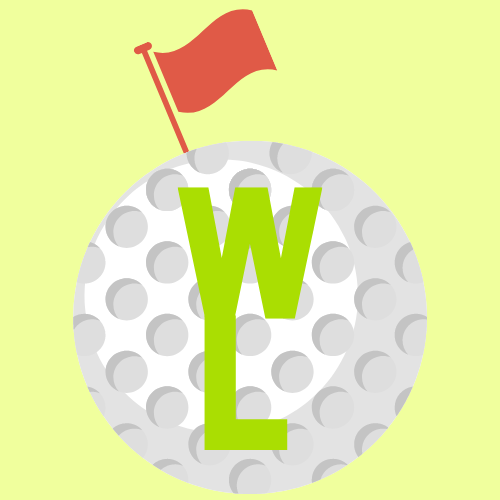

### __Demo__

The live site can be viewed here - [Word Links](https://cmed01.github.io/portfolio-milestone-2/)

Github repository can be viewed here - [CMed01/portfolio-milestone-2](https://github.com/CMed01/portfolio-milestone-2)

## Table of Contents
* [User Experience](#user-experience)
* [Technologies](#technologies)
* [Testing](#testing)
* [Deployment](#deployement)
* [Credits](#credits)

## __User Experience__

### __Strategy__
The aim of the website is to display an interactive golf themed hangman game.
Reasons for the site:
* Enjoyment
* Quiz

#### __User Stories__
* As a user I want to be able to:

    1. Easily understand the main purpose of the website.
    2. Easily navigate throughout the website to find and interact with the content.
    3. Access the site from different devices
    4. Play 3 rounds of the hangman style game.
    5. See a running points counter.
    6. See a time of the remaining time left to complete the three rounds.
    7. Get feedback on whether answers were correct or not.
    8. On successful completion of the game, obtain a high score and feedback message.
    9. Restart/reset the game and to enjoy playing the game multiple times.

### __Scope__
Functionally the site must be:
* Easy to navigate
* Well presented and display a funlly functioning golf themed hangman-style game

Content should include the following:
* Provide the user with the rules of the game.
* Provide interactive fuctionailty to play the game.
* Link to the developers GitHub account.

### __Structure__
Based on the content required in the scope of this projec, this website will consist of only 1 page. The home page will have the game title display clearly the rules of the game with a start button. On click of the start button the game will load and have interactive functionailty. The game will be contained in a centralised container, with a golf themed background image.

### __Skelton (Wireframes)__

Single wireframe image. The website will be responsive fitting all elements inside the width of the user screen.
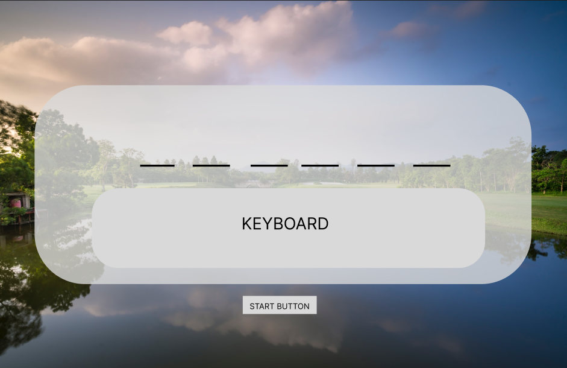
 
Additon to the wireframe includes:
* Points counter.
* Timer.
* Restart buttons that will appear after game loading.

### __Surface (including Features)__
#### __Colour Scheme__
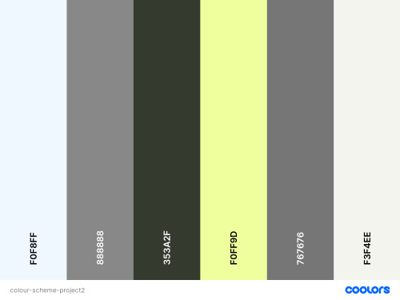
#### __Typography__
*  Google fonts was used for the typography for this website
    * Fira Sans - used for all heading 1 elements
    * Noto Sans - used for all other headings and labels
    * Trykker - used for all other body elements
    * Sans serif - used as back-up font
 
#### __Features__
* Home page
    * Game title to be visible at the top of the page. 
    * Clear game container displaying the rules of the game and a "new game" start button.
    * The background displays a scenic golf hole immersing the user into the theme for the game.
    * A GitHub link will be present at the bottom of the page and when clicked th user will be taken to the developers GitHub repository

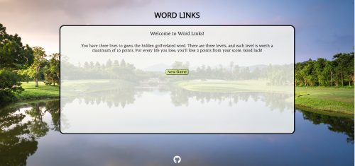

 

* New game button
    * On click of this button, the following will take place:
        1. A lives counter will load and display three lives, each represented with a golf ball on a tee image.
        2. A points counter will load displaying "0" at the start of the game.
        3. A keyboard with 26 individual buttons, container letters A-Z, will appear. These buttons will have clickable functionality.
        4. A random question will load at the top of the screen.
        5. The answer to the question will appear obscured by a series of dashes. Each dash representing a letter in the answer.
        6. The answer will appear initialling a blank underscores, each underscore representing a letter.
        7. The "new game" button will be replaced with a "restart button", which when clicked will reload the page and bring the user back to the start

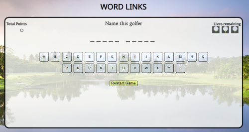

 

* Game screen
    * The user can interact with the game by clicking on infividual letters. Doing so will check if the chosen letter matches a letter in the randomly generated hangman
    * If the letter is correct, then it will replace the underscore with the chosen letter
    * If the letter is not correct, the user will lose a life, which will be refelected the lives counter
    * After pressing a button, the button will be disabled preventing duplication.

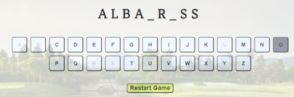

* Level complete
    * If the user selects all the correct letters without losing all their lives. The keyboard will be replaced with a winning message will appear (a different one for level 1 and level 2).
    * The points counter will be updated to reflect the win, with a total on 10 points on offer. 
    * Each live lost will reduce the score by 2 points.
    * A "next level" button will appear along side the "restart button", and when click will generate another random question.

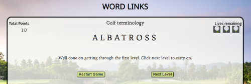
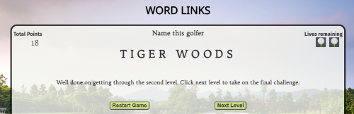

* Completion of game
    * If the user successfully completes three levels, the keyboard will be replaced with a congratulations message will appear.
    * The total points scored by the user will be included in the message.
    * Only the restart button will be present allowing the user to replay the game.
    
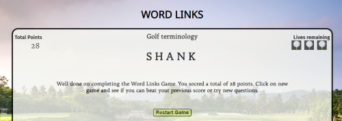

* Game over
    * If the user selects three incorrect letters before the word is fully revealed the keyboard will be replaced with a game over message. 
    * The full word will not be revealed to allow for replayability
    * A "restart game" button will be present for the user to click and restart the game. On click the page will be reloaded, subsequantly restarting the game.

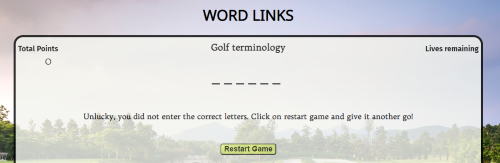

* Future
    * Add code to prevent recurrent questons being selected during one game (i.e. between level 1, 2 and 3)
    * Increased question bank to improve replayability
        * There are currently 20 questions. This can be increased substantionally to allow further replayability.
    * Allow user to filter the question choice
        * Currently the questions are all contined in a single array. Future changes can group these into categories, allowing the user to filter the questions asked.
    * Allow user to chose the size of the questions for each game (currently set at 3 levels). This will further increase replayability.
    * Hint button
        * For each questions, there will be two hints on offer.
        * A button will be present for the user to reveal these hints providing support to the user to answer the hangman correctly
        * Each hint will dimish the score by 2 points. 
    * Record user's high scores
        * There is currently no function for the user to enter in any personal details, such as a username. Additon of this will further enhance user replayability.
        * A high score storing function will challenge users to beat their previous attempts.
    * Introducee a timer function to add extra pressure to answer all questions correctly.

## __Technologies__

### __Languages__

* HTML
* CSS
* JavaScript

### __Frameworks, programs and libraries__

* [Figma](https://www.figma.com/) - Used to create wireframes for this website.
* [Stack Overflow](https://stackoverflow.com/) - Used to troubleshoot HTML, CSS and JavaeScript coding queries.
* [Google Fonts](https://fonts.google.com/) - Used to apply fonts to this website.
* [Fontjoy](https://fontjoy.com/) - Used to create font pairings.
* [Am I Responsive?](https://ui.dev/amiresponsive) - Used to create an image of website on various screen sizes.

## __Testing__

### __Validator testing__

* __[W3C Markup Validation Service](https://validator.w3.org/)__
    - Pass with no errors or warnings
    - 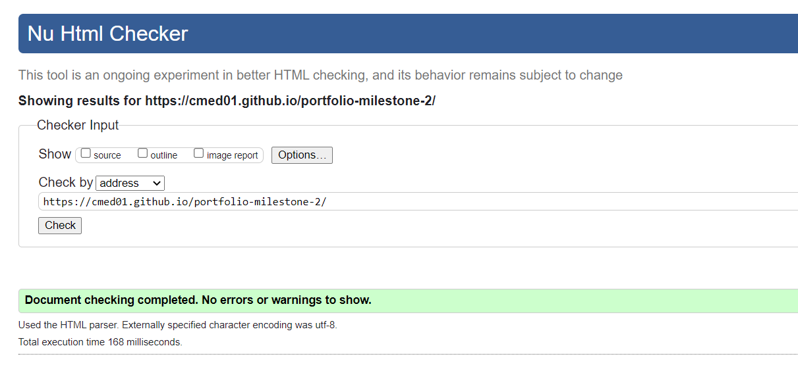

 

* __[W3C CSS Validation Service](https://jigsaw.w3.org/css-validator/)__
    - Pass with no errors found.
    - 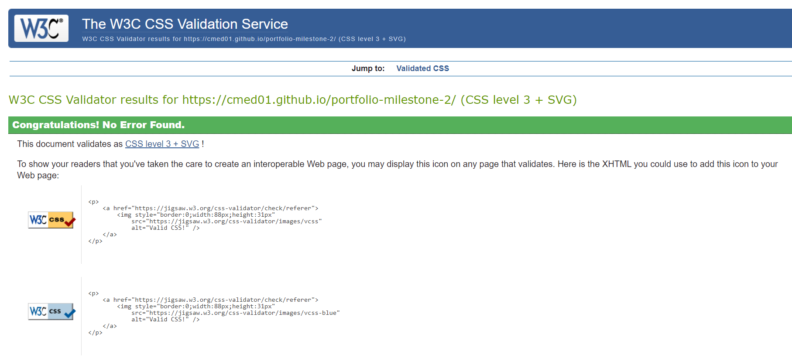
    
     

* __[JavaScript Testing (JSHint)](https://jshint.com/)__
    - There are 15 functions in this file.
    - Function with the largest signature take 2 arguments, while the median is 0.
    - Largest function has 19 statements in it, while the median is 6.
    - The most complex function has a cyclomatic complexity value of 4 while the median is 2.
    - 1 warning on line 174
        - Functions declared within loops referencing an outer scoped variable may lead to confusing semantics. (btnArray, button, dash, winCount, spaceCount, blocker, levelWon, loseCount, removeLifeIcon, gameOver)
        - Nil errors/bugs found in testing
    - One unused variable - nextLevelBtn
        - This variable is related to a function, which is added an an attribute when creating a new level button. 
        - Change set attribute to addEventListener and variable now used.

* __Lighthouse testing using (Google Dev Tools)__
    - Performance can be improved by:
        - Serving static assests with an efficient cache policy
        - Avoid enormous network payloads.
    - 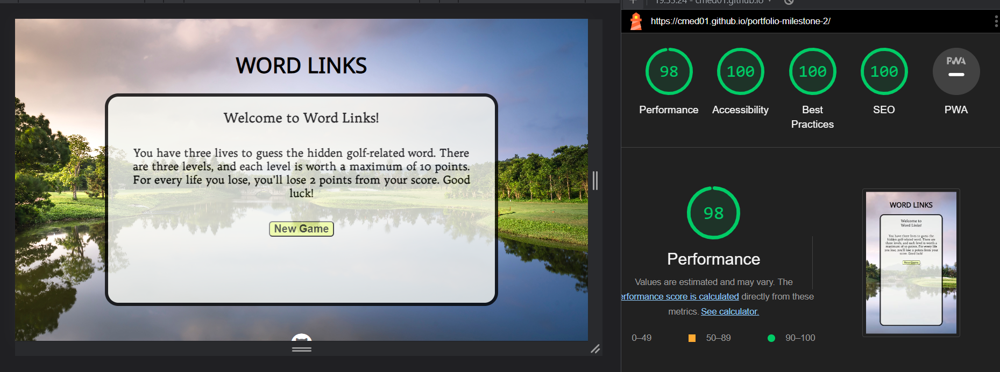

### __Browser Compatability__
* Browser testing was completed on the following browsers using [SauceLabs](https://saucelabs.com/)
    - Chrome Version 112.0.5615.138 (Official Build) (64-bit)
    - Firefox Version 111.0 (64-bit) 
    - Edge Version 112.0.1722.34 (Official Build) (64-bit)
    - Safari Version 16.1 (18614.2.9.1.12) (accessed via macOS Ventura 13) 

### __Test Cases and Results__
| Test no. |            Test Label            |         Test Action         |                                                                                                                                                                                                                                                                                                                                                     Expected Outcome                                                                                                                                                                                                                                                                                                                                                    | Test Outcome |
|:--------:|:--------------------------------:|:---------------------------:|:-----------------------------------------------------------------------------------------------------------------------------------------------------------------------------------------------------------------------------------------------------------------------------------------------------------------------------------------------------------------------------------------------------------------------------------------------------------------------------------------------------------------------------------------------------------------------------------------------------------------------------------------------------------------------------------------------------------------------:|:------------:|
| T01      | UX - Page Load                   | Load page                   | The game container is central to the page and contains the following: 1. The title is capitalised 2. A welcome message appears 3. A new game button with a light green backgound appears                                                                                                                                                                                                                                                                                                                                                                                                                                                                                                                                | Pass         |
| T02      | Interaction - New Game Button    | Click new game button       | On click the game loads and contains: 1. Total Points and 0 is displayed in the top left 2. Question details top center 3. Lives remaining and three square images, evenly spaced 4. A hangman styled display with a number of underscores 5. A keyboard with 26 evenly spaced letter buttons 6. New game button is replaced with a start button                                                                                                                                                                                                                                                                                                                                                                        | Pass         |
| T03      | Interaction - Letter buttons     | Click all 26 letter buttons | If a letter is present in the game answer, then an underscore/s will e replaced with the associated letter button. I.e. If "L" is clicked and present all the "L"'s present in the answer will be revealed.  If a letter is not present then the associated letter will not appear and 1 image under lives remaining will disappear. Once all three images have dissappeared (i.e. three incorrect letters) The game over function will occur. See test T08.  As this is a live game - during the above process, click restart button as needed to restart the game and continue to test each button functionaility.  All letter buttons when cicked will be disabled and not allow the user to click the button again. |              |
| T04      | Interaction - Restart button     | Click the restart button    |                                                                                                                                                                                                                                                                                                                                                                                                                                                                                                                                                                                                                                                                                                                         |              |
| T05      | UX - Total Points                |                             |                                                                                                                                                                                                                                                                                                                                                                                                                                                                                                                                                                                                                                                                                                                         |              |
| T06      | UX - Lives remaining             |                             |                                                                                                                                                                                                                                                                                                                                                                                                                                                                                                                                                                                                                                                                                                                         |              |
| T07      | UX - Level win                   |                             |                                                                                                                                                                                                                                                                                                                                                                                                                                                                                                                                                                                                                                                                                                                         |              |
| T08      | UX - Game over                   |                             |                                                                                                                                                                                                                                                                                                                                                                                                                                                                                                                                                                                                                                                                                                                         |              |
| T09      | UX - Game win                    |                             |                                                                                                                                                                                                                                                                                                                                                                                                                                                                                                                                                                                                                                                                                                                         |              |
| T10      | Interaction - Next level button, |                             |                                                                                                                                                                                                                                                                                                                                                                                                                                                                                                                                                                                                                                                                                                                         |              |

## __Deployement__

### __How this site was deployed__

1. In the GitHub repository, navigate to the Settings tab, then choose Pages from the left hand menu

2. From the source section drop-down menu, select the Master Branch

3. Page will be automatically refreshed with a detailed ribbon display to indicate the successful deployment

4. Any changes pushed to the master branch will automatically start a workflow to build and deploy the page with the update code.

The link to the live website can be found here - 

### __How to clone the repository__

1. Go to the 
 repository on GitHub.

2. Click the "Code" button to the right of the screen, click HTTPs and copy the link there

3. Open a GitBash terminal 

4. Change the working directory to the location where you want the clone directory.

5. On the command line, type "git clone" then paste in the copied url (https://github.com/CMed01/Portfolio-Milestone-1.git) and press the Enter key to begin the clone process

## __Credits__

### __Content__

* All content was written by the developer

### __Code__

* Code on how to add a Favicon to the website was based on example code from [W3Schools HTML Favicon](https://www.w3schools.com/html/html_favicon.asp#:~:text=To%20add%20a%20favicon%20to,is%20%22favicon.ico%22.)

### __Media__

### __Acknowledegements__

I would like to express my gratitude to my mentor Brian Macharia, for his guidance, support and encouragement throughout my second project.